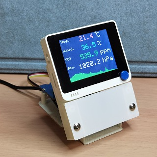
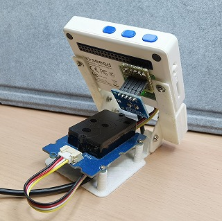

# Wio Terminalを用いた環境モニタ

## 使用部品
- [Wio Terminal](https://wiki.seeedstudio.com/jp/Wio-Terminal-Getting-Started/)
- [Sensirion SCD30搭載 CO2センサモジュール](https://wiki.seeedstudio.com/jp/Grove-CO2_Temperature_Humidity_Sensor-SCD30/)
- [ROHM BM1383AGLV搭載 気圧センサモジュール](https://ssci.to/2776)

## 投稿動画（解説・Demo）
- [CO2計作ったで](https://www.nicovideo.jp/watch/sm39090561)（ニコニコ動画）

## 参考文献
- [基礎から学ぶ 組込みRust](https://github.com/tomoyuki-nakabayashi/Embedded-Rust-from-Basics)

## Licence
- [NYSL](http://www.kmonos.net/nysl/)
